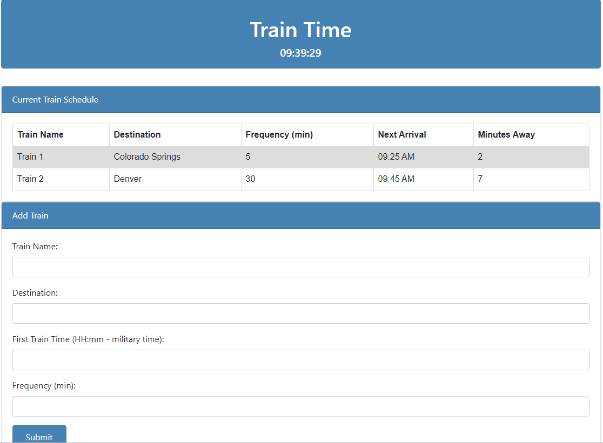

# TrainTime


# Project Overview:
```
A train schedule application that incorporates Firebase to host arrival and departure data and Moment.js 
to manipulate time calculations. This website provides up-to-date information about various trains, 
namely their arrival times and how many minutes remain until they arrive at their station. It also 
allows admins to add new trains.
```

# Project Requirements:
```
Display Requirements:
    1. Display Title
    2. Display current time
    3. Display a table of scheduled trains
        a. Train Name column
        b. Destination column
        c. Frequency in minutes column
        d. Next Arrival column (hh:mm AM/PM format)
        e. Minutes away column (display minutes)

    4. Form input area where admins can add new trains
        a. Train name
        b. Train Destination
        c. First Train Time (in military forat)
        d. Frequency (in minutes)
        e. Submit button
        f. An alert to indicate to the user that the train has been added

Logic Requirements:
    1. Calculate the Next Arrival Time to be displayed in hh:mm AM/PM format
    2. Calculate Minutes Away to be displayed in minutes
    3. Update entire table upon each addition and at screen load
 
Technology Requirements:
    1. Page Layout
        a. HTML
        b. CSS
    2. Game Logic
        a. Javascript
        b. Moment.js
    3. DOM manipulation
        a. jQuery
    4. Database
        a. Firebase
```
 
 ### Game Link: https://kbrowngithub.github.io/TrainTime/
 
 # Features
 #####
```
 
 Display Screen

 ```
 
 
 ```